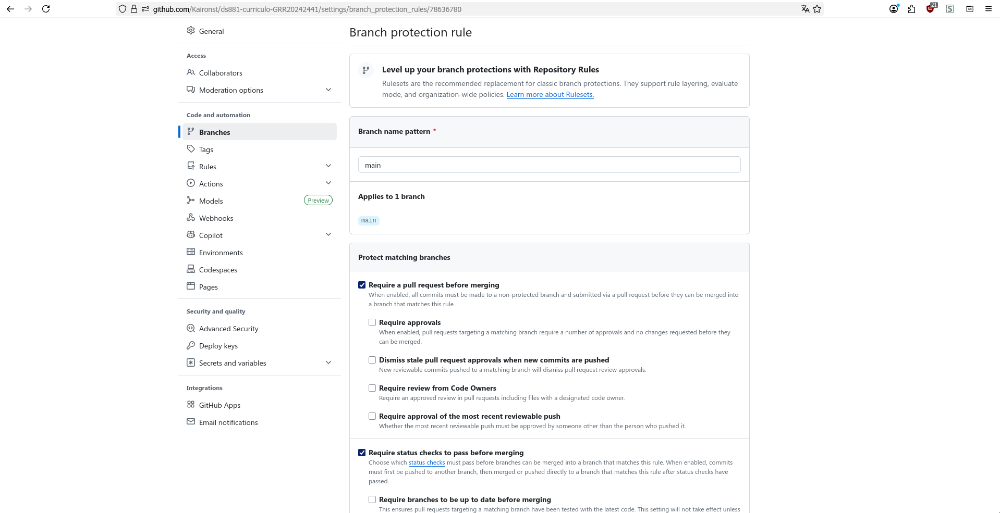
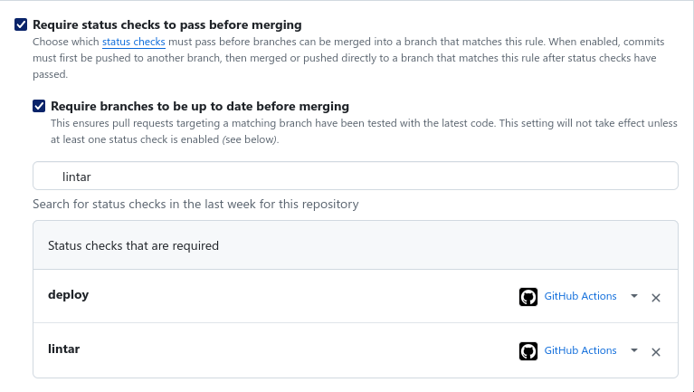

# Projeto Individual: Currículo Online DS881

---

## [Link da Página do currículo](https://kaironst.github.io/ds881-curriculo-GRR20242441/)

---

## Execução do ambiente local via docker

    1. estar na pasta do projeto no terminal
    2. executar 
```bash
 $ docker compose up -d --build `
```
    3. acessar localhost:8080 no navegador e editar o código


---

## Configuração da proteção de branch




